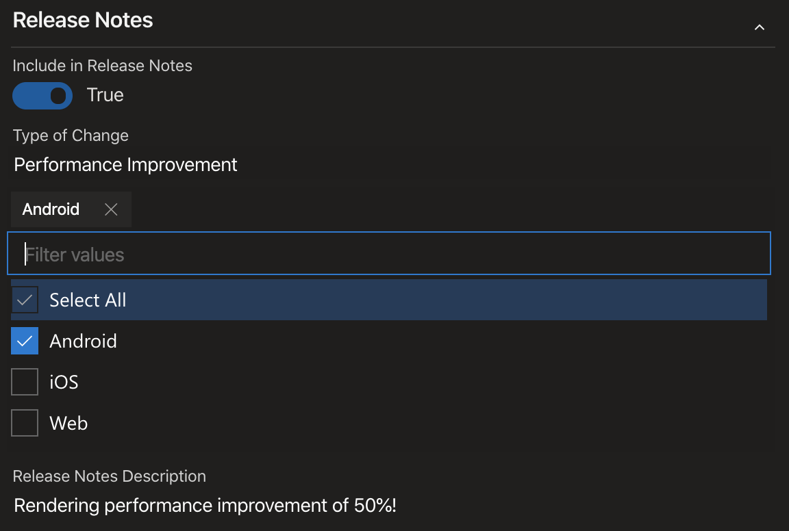
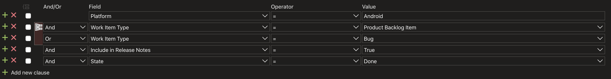
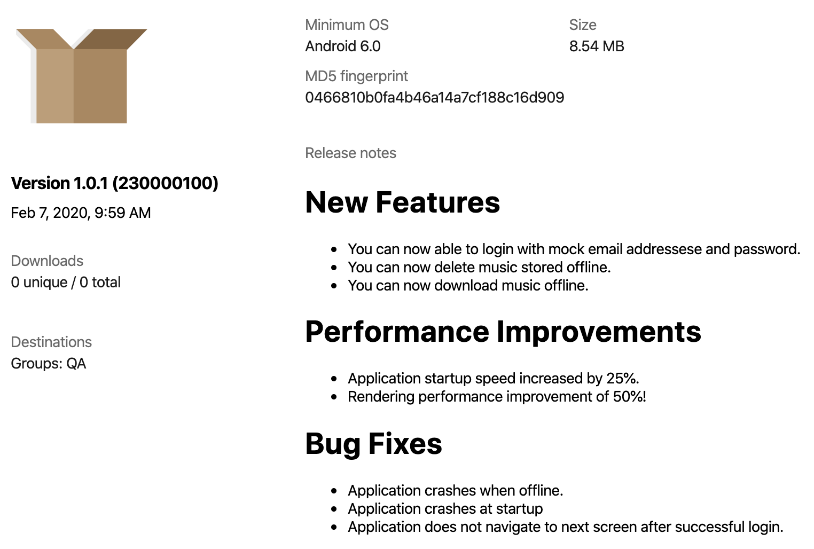

There are many different approaches you can take for release notes process. When you are creating a release notes process, I find that it is imperative that you consider the entire software development lifecycle. It is not as simple as collecting all of your Git commit history and presenting that as your release notes. The following release notes process is centered around Azure DevOps, but it can just as easily be implemented in another platform.

# Analysis

Here are some questions you should ask yourself before you create a process:

1. Who is the audience for my release notes? Public facing users? Internal users?
2. What kind of data do I want to capture with my release notes? Do I want to categorize these notes somehow?
3. Who will enter these release notes?
4. How will they be reviewed for grammar and spelling issues?
5. What file format should these release notes be in?
6. What should the layout look like?
7. What are some guidelines for good release notes?
8. Do I want to track the history of release notes inside my Git repo?

For my process, the audience was public facing as these release notes were for the public facing app store release changes. The data I wanted to capture was the following categories: Bug Fix, Performance Improvement, New Features, among others. From my perspective, release notes are a responsibility of the entire team so they should be entered by everyone and you should provide guidelines on what good release notes look like; for my purposes I gave some examples of how release notes should only be 1-2 sentences long at most, in simple language (i.e. not technical). At my company, the final release notes do need to be reviewed by another department so that is definitely a consideration. The file format was chosen to be markdown since that is what App Center liked to use and Markdown can be easily converted to other formats. The layout was simple since the App Stores don't like any fancy layouts. Finally, I determined that the history should be tracked inside the Git repo.

# Implementation

To capture the release notes, you need to modify your process such that you can enable the team to easily capture the notes. For my purposes, this meant modifying the Product Backlog Item (PBI), or user story, and Bug items inside Azure Devops and including the following fields: a boolean flag for "Include in Release Notes", a multi-option dropdown for "Plaform", and a text area for "Release Notes Description".


This is what a PBI and Bug looks like. The platform is a multi-value control found [here](https://marketplace.visualstudio.com/items?itemName=ms-vsts-witiq.vsts-extensions-multi-values-control).

I also created a query in Azure DevOps such that the product owner (PO) can execute and retrieve the list of PBIs and Bugs that were to be included in the next release. The purpose of this is to share these PBIs and Bugs with the team to ensure that it is the correct list _prior_ to doing a release to a specific environment.


The above is how I setup the Android query. You should add additional fields to filter it down based on iteration path or dates so that you are only capturing the items you want from the last time you did a release.

This is all that is required to start collecting data. Now, let's move on to how to actually use these two things to generate a release notes document. I am going to assume that you want to release to a QA environment first and that you have some sort of approval process _before_ you can deploy to the QA environment and you will require approval from the PO.

Before granting approval, the PO will share the results of the query with the team and perform the necessary modifications to the items; clean up descriptions, include/remove items from the release notes, etc.. Once satisfied, the PO will approve the release.

As part of this QA release process, a script should run which will take all the PBIs and Bugs from this query and generate a markdown file. This markdown file will then be committed to the repo under a `docs\release_notes` directory or where ever you would like to store it. Once generated and committed, the file will then be shared with the necessary party. This file generation will only happen _once_! Why? Because there is no value in continuously regenerating this file and having people go back to the PBIs to correct the release notes. The PO will edit this file based on feedback they receive from others (i.e. fix misspelling, grammar, remove items, correct formatting, etc.) and then submit a PR to commit the modified release notes.

Here is a sample `ReleaseNotesGenerator.csx` file which I created to generate this markdown file. You can't use this directly, but it should give you an idea of what would need to be done.

```csharp
#!/usr/bin/env dotnet-script
#r "nuget: Microsoft.TeamFoundationServer.Client, 16.153.0"
#r "nuget: MarkdownLog, 0.9.64"
#r "nuget: Humanizer, 2.7.9"
#load "Azure-DevOps/TFSConstants.csx"
#load "Azure-DevOps/TFSConnectionProvider.csx"
#load "Azure-DevOps/TFSFieldValidator.csx"

using System;
using System.Linq;
using System.IO;
using Microsoft.VisualStudio.Services.WebApi;
using Microsoft.VisualStudio.Services.Common;
using Microsoft.TeamFoundation.WorkItemTracking.WebApi;
using MarkdownLog;
using Humanizer;
using Microsoft.TeamFoundation.WorkItemTracking.WebApi.Models;
using Microsoft.TeamFoundation.Build.WebApi;

string platform;
string personalAccessToken;
bool noPlatform;
var fileName = "latest";

foreach (var argument in Args)
{
    if (argument.StartsWith($"-{nameof(platform)}"))
    {
        platform = argument.Substring(argument.IndexOf("=") + 1).ToLower();
    }
    if (argument.StartsWith($"-{nameof(personalAccessToken)}"))
    {
        personalAccessToken = argument.Substring(argument.IndexOf("=") + 1);
    }
}
if (string.IsNullOrWhiteSpace(platform))
{
    throw new ArgumentException("Missing platform argument: -platform=android, -platform=ios, or -platform=none");
}
if (string.IsNullOrWhiteSpace(personalAccessToken))
{
    throw new ArgumentException("Missing personal access token argument: -personalAccessToken=PAT");
}

noPlatform = platform == "none";
var markdownDocumentBuilder = new StringBuilder();
IEnumerable<int> workItemIds = Enumerable.Empty<int>();
var tfsConnectionProvider = new TFSConnectionProvider(personalAccessToken);
var workItemTrackingClient = tfsConnectionProvider.Connection.GetClient<WorkItemTrackingHttpClient>();

if (noPlatform)
{
    var buildId = Environment.GetEnvironmentVariable("BUILD_BUILDID");
    var buildClient = tfsConnectionProvider.Connection.GetClient<BuildHttpClient>();
    var results = await buildClient.GetBuildWorkItemsRefsAsync(TFSConstants.Project, Convert.ToInt32(buildId));
    workItemIds = results.Select(item => Convert.ToInt32(item.Id));
}
else
{
    var results = await workItemTrackingClient.QueryByIdAsync(TFSConstants.Project, TFSConstants.PlatformQueryIdMap[platform]);
    workItemIds = results.WorkItems.Select(item => item.Id);

    var branchName = Environment.GetEnvironmentVariable("BUILD_SOURCEBRANCHNAME");
    fileName = branchName.Substring(0, branchName.Length - (platform.Length + 1));
}

if (workItemIds.Any())
{
    var workItemDetails = await workItemTrackingClient.GetWorkItemsAsync(TFSConstants.Project, workItemIds);
    var validWorkItemTypes = new HashSet<string>() { TFSConstants.WorkItemTypes.Bug, TFSConstants.WorkItemTypes.ProductBacklogItem };

    workItemDetails = workItemDetails.Where(item => validWorkItemTypes.Contains(item.Fields[TFSConstants.Fields.WorkItemType].ToString())).ToList();

    var groups = workItemDetails.GroupBy(item => item.Fields[TFSConstants.Fields.ReleaseNotesTypeOfChange]);

    var fieldValidator = new TFSFieldValidator();

    foreach (var group in groups)
    {
        var heading = group.Key.ToString().Pluralize().ToMarkdownHeader();
        markdownDocumentBuilder.Append(heading);
        var items = group.ToList();
        fieldValidator.WorkItems = items;

        if (items.Any(item => item.Fields[TFSConstants.Fields.WorkItemType].ToString() == TFSConstants.WorkItemTypes.Bug))
        {
            fieldValidator.ValidateField(TFSConstants.Fields.Severity);
            items = items.OrderByDescending(item => Convert.ToInt32(item.Fields[TFSConstants.Fields.Severity].ToString()[0])).ToList();
        }
        else
        {
            fieldValidator.ValidateField(TFSConstants.Fields.BusinessValue);
            items = items.OrderByDescending(item => Convert.ToInt32(item.Fields[TFSConstants.Fields.BusinessValue].ToString())).ToList();
        }

        fieldValidator.ValidateField(TFSConstants.Fields.ReleaseNotesDescription);
        markdownDocumentBuilder.Append(items.Select(item => item.Fields[TFSConstants.Fields.ReleaseNotesDescription].ToString()).ToMarkdownBulletedList());
        markdownDocumentBuilder.Append("\r\n");
    }
}
var content = string.IsNullOrEmpty(markdownDocumentBuilder.ToString()) ? "There are no new changes." : markdownDocumentBuilder.ToString();
var filePath = noPlatform ? $"docs/release_notes" : $"docs/release_notes/{platform}";
Directory.CreateDirectory($"{filePath}");
File.WriteAllText($"{filePath}/{fileName}.md", content);
```

In my case, once the release notes were created, I would use this as the release notes for App Center as shown below.



Any subsequent commits to your release branch _should not_ regenerate the release notes file. If changes need to be made, have them be a PR into this release branch. In my case, the PO also approved to the staging environment so I am expecting the release notes to be fully correct by the time we are ready to merge into master and release to stage and these releae notes will be used for the public too. If you did want to make modifications even after going to stage, again make a PR into master or whatever branch you are working with.

And that's pretty much it. I find this works very well for our team and hopefully this gives you some insight into what you can do for your own team.
