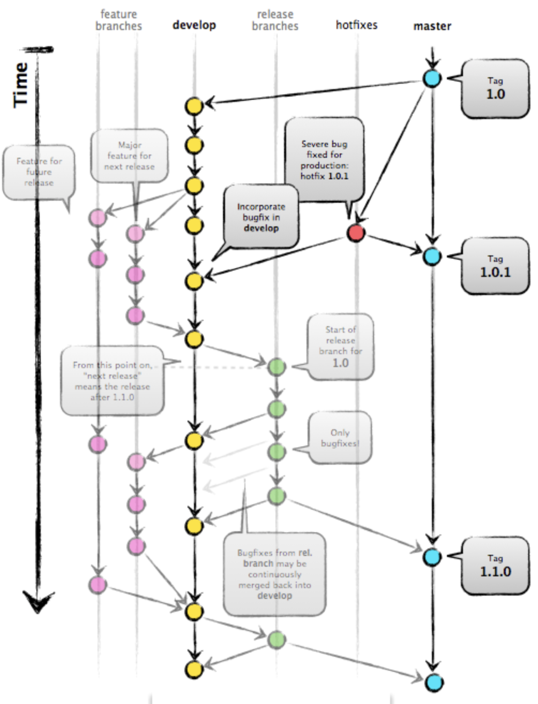
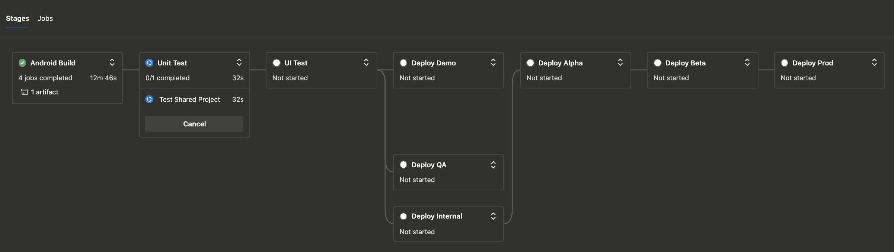

I am going to describe a Xamarin Native workflow that works for a production system from local development machine to production.

# Git First

The Xamarin workflow uses Gitflow at its core and builds around it.



Since Xamarin is a cross-platform solution, some modifications to the flow are performed. When creating a release branch, the suffix of the branch ends with `-android` or `-ios`. The purpose of this is to act as an identifier to push the specific release through App Center. When we are merging into master, we are tagging the commit as `-android` and `-ios` as well, along with the prefixed version number as `v.x.x.x`. This allows us to maintain separate version numbers for each platform.

# Local Development

Before a commit will go through on a user's local machine, githooks are run which will build, test, and lint their code. The githooks live in a `.githooks` directory and the developer must run an `INSTALL_GITHOOKS.sh` file to copy those files over to the proper area under the user's `.git` directory. Here are the simple contents of this file:

```bash
#!/usr/bin/env bash
find .git/hooks -type f -exec rm {} \;
find .githooks -type f -exec chmod +x {} \;
find .githooks -type f -exec ln -sf ../../{} .git/hooks/ \;
```

The purpose of githooks is to ensure that your developer's can be sure their code meets your style guidelines, it is well tested, and compiles.

# Build and Release Workflow

If developers are working on any branch that isn't `develop`, the project will be built in `Debug` configuration just to ensure that the code compiles. This applies to pull requests and feature branches.

For the `develop` branch, a pipeline artifact is created with a signed APK or .ipa. Builds on this branch run in a `Demo` configuration. The purpose of the `Demo` configuration is to allow your app to function against mock repositories. This allows your developers to iterate quickly against their app and get feedback quickly without being incumbered by back-end API design decisions. Once the build is complete and the code is unit tested, it is deployed to an App Center group for stakeholders that want to get quick feedback on the app. Release notes are generated using commits that occurred in the pipeline which have `Include in Release Notes` flipped to true. More information on that can be found in the <a href="/release-notes">release-notes</a> post.

Once a product owner (PO) requests a release, the developer will create the appropriate release branch as `v.x.x.x-android` or `v.x.x.x-ios`. This will kick off a build in the `QA` configuration and the code will be unit tested. Every subsequent commit to this branch will be built, tested, and deployed to the QA group inside App Center.

Once the PO is ready to release to the staging environment, the developer will merge and tag the commit into the master branch as `v.x.x.x-android` or `v.x.x.x-ios`. This will trigger the appropriate build stage so the project can be built in the `Stage` and `Release` configurations. From there, the artifacts for stage and release are used; stage artifact for the internal step and release artifacts for any environment that is higher. Below is what this pipeline looks like in Azure Pipelines.



The only step not discussed is the UI test and this step can be flexible. It can run nightly since it takes a while to finsh but this step is also necessary to ensure a high quality product and for you to have confidence in your release, regardless of how long the UI tests might take.
